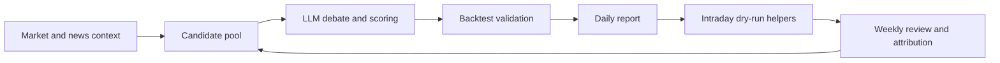

# Daily Stock Workflow

[中文文档](README.zh-CN.md)

An experimental A-share stock-selection workflow that combines market data,
news/context collection, multi-factor LLM scoring, backtesting, intraday
execution helpers, and weekly review loops.

This repository is a sanitized public version. Runtime reports, logs, account
state, broker exports, API keys, webhook URLs, and local machine paths are not
included.

## Workflow



## What It Does

- Phase 1: collect market, news, technical, fundamental, and sentiment context.
- Phase 2: build candidate pools and run LLM-assisted stock debate/scoring.
- Phase 3: backtest Top candidates before producing operation suggestions.
- Phase 4: optional intraday timing, position monitoring, and notification.
- Review: weekly attribution and parameter updates.

## Safety Defaults

The public checkout is intended to run in dry-run mode first. Real trading
requires your own broker/QMT bridge, explicit environment configuration, and
independent validation.

Nothing in this project is financial advice. Use it as research code.

## Who It Is For

- Quant and retail-tooling researchers who want an end-to-end A-share workflow.
- Python developers experimenting with LLM-assisted market research.
- Builders who need a dry-run framework before connecting real data or broker APIs.

## Setup

```bash
python3 -m venv .venv
source .venv/bin/activate
pip install -r requirements.txt
cp .env.example .env
```

Fill `.env` with your own provider keys and local data-bridge settings. Keep
`.env` private.

## Minimal Dry-Run Setup

Start without real trading credentials:

```bash
cp .env.example .env
printf '\nDRY_RUN=1\n' >> .env
python3 workflow.py
```

Some data and LLM paths require provider keys. When a provider is not configured,
expect the workflow to skip or degrade that part rather than perform live calls.

## Common Commands

```bash
# Full daily workflow. Calls external data and LLM providers when configured.
python3 workflow.py

# Stable wrapper with lock/watchdog handling.
python3 run_daily_stock_workflow_stable.py

# Intraday buy timing helper.
python3 intraday_executor.py --mode=buy-timing

# Position monitor.
python3 intraday_executor.py --mode=monitor

# Current status.
python3 intraday_executor.py --mode=status

# Money-flow quality check.
python3 check_money_flow_quality.py --days 10

# Top5 attribution review.
python3 top5_review_attribution.py --days 10
```

## Demo and Examples

- [Demo walkthrough](docs/demo.md)
- [Chinese launch article draft](docs/launch-article.zh-CN.md)
- [Short social posts](docs/social-posts.zh-CN.md)

## Configuration

Important environment variables are documented in `.env.example`.

- `DRY_RUN=1` is the recommended starting mode.
- `MX_APIKEY`, `MINIMAX_API_KEY`, `MX_DIRECT_KEY`, `VOLCAN_API_KEY`, and
  `VOLCAN_ENGINE_API_KEY` are optional provider keys depending on which model
  and data paths you enable.
- `FEISHU_WEBHOOK_URL` enables Feishu notification pushes.
- `QMT_HTTP_URL` and `XQSHARE_HTTP_BASE` point to your local market/trading
  bridge. Public defaults use `127.0.0.1` placeholders.

## Runtime Files

Generated files stay local and are ignored by Git:

- `logs/`
- `output/`
- `runtime_archive/`
- `knowledge-base/*.json`
- `weekly_strategy/checkpoints/*.json`

## License

MIT

## Contributing

Issues and pull requests are welcome. See [CONTRIBUTING.md](CONTRIBUTING.md)
and [ROADMAP.md](ROADMAP.md) for the current direction.
