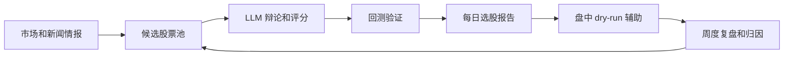

# 每日选股工作流

[English README](README.md)

当前版本：**v0.2.0** · [更新日志](CHANGELOG.md) · [版本说明](docs/releases/v0.2.0.md)

一个面向 A 股研究的实验性选股工作流，覆盖市场信息收集、候选池构建、LLM 多因子评分、回测验证、盘中执行辅助和周度复盘。

这是经过清理的公开版本。仓库不包含真实运行报告、日志、账户状态、券商导出文件、API Key、Webhook 地址或本机路径。

## v0.2.0 主要更新

- 新增带版本的数据路由契约，记录数据来源、新鲜度、降级链路和缺失状态。
- 新增可验证行情快照，统一输出均线、RSI、MACD、KDJ、ATR、量能和价格位置等事实。
- 新增知识规则与历史边际规则，评分调整保留规则来源和证据字段。
- 工作流支持按候选池、筛选签名、评分版本和辩论节点进行断点恢复。
- 新增统一模型路由，可通过环境变量配置主模型和两级降级模型。
- 盘中决策事件与周度执行归因可追踪，便于复盘买入时机和未成交原因。

## 工作流



## 功能概览

- Phase 1：收集市场、新闻、技术面、基本面和情绪信息。
- Phase 2：构建候选股票池，并使用 LLM 辅助辩论和多因子评分。
- Phase 3：对 Top 候选股做回测验证，再生成操作建议。
- Phase 4：提供可选的盘中买入时机、持仓监控和通知推送辅助。
- 复盘：支持 Top5 归因复盘、周度总结和参数更新。

## 安全默认值

公开版本建议先以 dry-run 方式运行。真实交易需要你自行配置本地行情/交易桥接服务、券商环境、模型服务密钥，并完成独立验证。

本项目不构成投资建议，仅用于研究和工程实验。

## 适合谁使用

- 想研究 A 股端到端选股流程的量化和工具开发者。
- 想尝试 LLM 辅助市场研究的 Python 开发者。
- 想先 dry-run 验证，再接入真实行情或券商接口的构建者。

## 安装

```bash
python3 -m venv .venv
source .venv/bin/activate
pip install -r requirements.txt
cp .env.example .env
```

然后在 `.env` 中填入你自己的模型、数据源、通知和本地行情桥接配置。不要提交 `.env`。

## 最小 dry-run 运行

先不配置真实交易凭据：

```bash
cp .env.example .env
printf '\nDRY_RUN=1\n' >> .env
python3 workflow.py
```

部分数据源和 LLM 链路需要对应服务密钥。未配置时，工作流应跳过或降级相关环节，而不是执行真实调用。

## 常用命令

```bash
# 完整每日工作流。配置外部数据源和 LLM 后会调用相关服务。
python3 workflow.py

# 带锁和 watchdog 的稳定运行入口。
python3 run_daily_stock_workflow_stable.py

# 盘中买入时机辅助。
python3 intraday_executor.py --mode=buy-timing

# 持仓监控。
python3 intraday_executor.py --mode=monitor

# 查看当前状态。
python3 intraday_executor.py --mode=status

# 检查最近 N 天资金流质量。
python3 check_money_flow_quality.py --days 10

# Top5 归因复盘。
python3 top5_review_attribution.py --days 10
```

## Demo 和传播材料

- [Demo 说明](docs/demo.md)
- [中文发布文章草稿](docs/launch-article.zh-CN.md)
- [短文案合集](docs/social-posts.zh-CN.md)

## 配置说明

主要环境变量见 `.env.example`。

- `DRY_RUN=1`：推荐的首次运行模式。
- `MX_APIKEY`、`MINIMAX_API_KEY`、`MX_DIRECT_KEY`、`VOLCAN_API_KEY`、`VOLCAN_ENGINE_API_KEY`：按你启用的模型和数据链路配置。
- `OPENAI_API_KEY`：使用 OpenAI API 路由时配置。
- `STOCK_SELECTION_DEFAULT_MODEL`、`STOCK_SELECTION_FALLBACK_MODEL`、`STOCK_SELECTION_SECONDARY_FALLBACK_MODEL`：配置主模型和降级顺序。
- `FEISHU_WEBHOOK_URL`：配置后启用飞书通知推送。
- `QMT_HTTP_URL`、`XQSHARE_HTTP_BASE`：指向你的本地行情/交易桥接服务。公开默认值使用 `127.0.0.1` 占位。

## 离线核心检查

```bash
python3 -m compileall -q .
python3 test_market_snapshot_router.py
python3 test_knowledge_rules.py
python3 test_candidate_edge_rules.py
python3 test_workflow_refactor_contracts.py
python3 test_selection_correctness_v3.py
```

发布改动前建议运行这些检查。依赖实时行情、模型服务或本地桥接的测试，应在具备相应服务的环境中单独运行。

## 运行产物

以下文件只应保留在本地，已通过 `.gitignore` 排除：

- `logs/`
- `output/`
- `runtime_archive/`
- `knowledge-base/*.json`
- `weekly_strategy/checkpoints/*.json`

仓库版本号保存在 `VERSION`，面向使用者的变化记录在 [CHANGELOG.md](CHANGELOG.md)。

## 开源前清理范围

公开仓库已移除或替换：

- `.env` 和真实 API Key
- 飞书 Webhook
- 真实交易、持仓和执行记录
- 历史运行报告、日志和缓存
- 本机绝对路径和内网地址
- Python 编译缓存和虚拟环境

## 许可证

MIT

## 参与贡献

欢迎提交 Issue 和 Pull Request。当前方向见 [CONTRIBUTING.md](CONTRIBUTING.md) 和 [ROADMAP.md](ROADMAP.md)。
