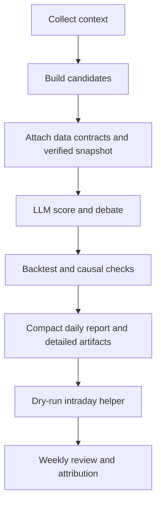

# Demo Walkthrough

This demo is intentionally dry-run first. It shows the expected shape of the
workflow without requiring private account data.

## 1. Install

```bash
python3 -m venv .venv
source .venv/bin/activate
pip install -r requirements.txt
cp .env.example .env
printf '\nDRY_RUN=1\n' >> .env
```

## 2. Run the Daily Workflow

```bash
python3 workflow.py
```

Expected output files are written under `output/` when the configured data
providers are available. `output/` is intentionally ignored by Git.

In v0.2.0, inspect these fields in candidate and report artifacts:

- `data_contract` and `data_router_summary` for source, freshness, and fallback status.
- `market_snapshot` for deterministic technical evidence.
- `knowledge_rule_hits` and scoring version fields for traceable score adjustments.
- `artifacts` for pointers to detailed candidate and trace files kept out of the compact report.

## 3. Inspect Money-Flow Quality

```bash
python3 check_money_flow_quality.py --days 10
```

Use this to understand whether missing money-flow fields came from unavailable
data providers or from local logic regressions.

## 4. Review Top5 Attribution

```bash
python3 top5_review_attribution.py --days 10
```

This summarizes recent Top5 candidates and classifies attribution patterns.
Provider failures should be treated separately from model or workflow logic
failures.

## 5. Run Offline Checks

```bash
python3 test_market_snapshot_router.py
python3 test_knowledge_rules.py
python3 test_candidate_edge_rules.py
python3 test_workflow_refactor_contracts.py
python3 test_selection_correctness_v3.py
```

## 6. Optional Intraday Helpers

```bash
python3 intraday_executor.py --mode=status
python3 intraday_executor.py --mode=buy-timing
python3 intraday_executor.py --mode=monitor
```

Keep `DRY_RUN=1` unless you have reviewed the execution code and configured
your own private broker bridge.

## Workflow Shape


