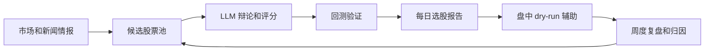

# 我开源了一个 A 股 LLM 选股工作流

我把自己使用的一套 A 股研究工作流整理成了开源项目：

https://github.com/dazyhuang/daily-stock-workflow

它不是荐股工具，也不是可以直接拿来实盘的黑盒交易系统，而是一个面向研究和工程实验的工作流框架。目标是把每天重复的选股研究动作拆成可检查、可复盘、可迭代的步骤。

## 它解决什么问题

手工选股最大的问题不是“看不看得懂一只股票”，而是每天的信息链太长：

- 市场和新闻情报
- 候选股票池
- 技术面、基本面、资金流等多因子信息
- LLM 辅助打分和辩论
- 回测验证
- 盘中执行辅助
- 周度复盘和归因

这个项目把这些环节组织成一个 Python 工作流，并且默认建议先 dry-run。

## 核心流程

## 为什么开源

我希望把它从“个人脚本集合”变成一个更容易被别人阅读、运行和改造的研究框架。公开版本已经清理掉真实 API Key、Webhook、交易记录、日志、账户状态和本机路径。

## 适合谁

- 想研究 A 股端到端选股流程的人
- 想尝试 LLM 辅助市场研究的 Python 开发者
- 想构建 dry-run 交易研究系统的人
- 想把复盘、归因、参数迭代工程化的人

## 重要提醒

这个项目不构成投资建议。真实交易需要你自行配置券商环境、行情桥接服务和风控规则，并独立验证每一条执行路径。

项目地址：

https://github.com/dazyhuang/daily-stock-workflow
